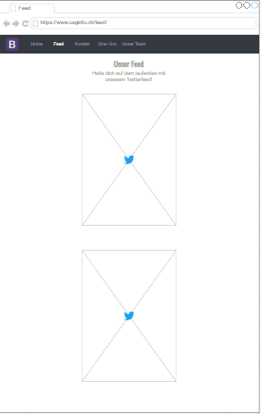

# USG Homepage Docs

### Inhaltsverzeichnis

- [USG Homepage Docs](#usg-homepage-docs)
    - [Inhaltsverzeichnis](#inhaltsverzeichnis)
  - [IPERKA](#iperka)
    - [Informieren](#informieren)
    - [Planen](#planen)
    - [Entscheiden](#entscheiden)
    - [Realisieren](#realisieren)
    - [Kontrollieren](#kontrollieren)
    - [Auswerten](#auswerten)
  - [IPERKA Ergänzungsprojekt](#iperka-ergänzungsprojekt)
    - [Informieren](#informieren-1)
    - [Planen](#planen-1)
    - [Entscheiden](#entscheiden-1)
    - [Realisieren](#realisieren-1)
    - [Kontrollieren](#kontrollieren-1)
    - [Auswerten](#auswerten-1)
  - [Einleitung](#einleitung)
    - [Technologien](#technologien)
    - [Ergänzungsprojekt](#ergänzungsprojekt)
  - [Erstellung des Mockups mit dem Kunden](#erstellung-des-mockups-mit-dem-kunden)
    - [Ein Mockup mit draw.io erstellen.](#ein-mockup-mit-drawio-erstellen)
  - [Lokale Entwicklungsumgebung einrichten](#lokale-entwicklungsumgebung-einrichten)
    - [Vorbereitung](#vorbereitung)
    - [NPM Installation](#npm-installation)
    - [Lokalen Server starten](#lokalen-server-starten)
  - [Kontribution](#kontribution)
    - [Allgemeines](#allgemeines)
      - [Sprache](#sprache)
      - [Audit und Snyk](#audit-und-snyk)
    - [Pull Requests](#pull-requests)
      - [Intern](#intern)
      - [Extern](#extern)
    - [Code Reviews](#code-reviews)
    - [Workflows](#workflows)
  - [Anforderungen](#anforderungen)
  - [Testen](#testen)
    - [Testfälle](#testfälle)
    - [Testprotokoll](#testprotokoll)
    - [Testbericht / Fazit](#testbericht--fazit)
  - [Components](#components)
    - [Komponenten für die Seiten](#komponenten-für-die-seiten)
      - [Logo.tsx](#logotsx)
      - [Slogan.tsx](#slogantsx)
      - [Title.tsx](#titletsx)
      - [Button.tsx](#buttontsx)
      - [GoogleForms.tsx](#googleformstsx)
      - [TwitterFeed](#twitterfeed)
      - [Navbar.tsx](#navbartsx)
      - [Membercard.tsx](#membercardtsx)
      - [MembercardGrid.tsx](#membercardgridtsx)
      - [Willkommenstext.tsx](#willkommenstexttsx)
    - [Pages](#pages)
      - [PageNotFound.tsx](#pagenotfoundtsx)
      - [Home.tsx](#hometsx)
      - [Feed.tsx](#feedtsx)
      - [Kontakt.tsx](#kontakttsx)
      - [Bewerben.tsx](#bewerbentsx)
      - [Scrims.tsx](#scrimstsx)
      - [UeberUns.tsx](#ueberunstsx)
      - [Team.tsx](#teamtsx)
    - [Sonstiges / Unsichtbares](#sonstiges--unsichtbares)
      - [index.tsx](#indextsx)
      - [Router.tsx](#routertsx)
  - [Ergänzungsprojekt](#ergänzungsprojekt-1)
    - [Anforderungen](#anforderungen-1)
    - [Testen](#testen-1)
      - [Testfälle](#testfälle-1)
    - [Einführung Deta](#einführung-deta)
      - [CLI \& Features](#cli--features)
  - [Rechtliches](#rechtliches)

## IPERKA

### Informieren

- [Einleitung](#einleitung)
- [README auf der Startseite des Repos](../README.md)
- [Lokale Entwicklungsumgebung einrichten](#lokale-entwicklungsumgebung-einrichten)

### Planen

- [Einleitung](#einleitung)
- [Erstellung des Mockups mit dem Kunden](#erstellung-des-mockups-mit-dem-kunden)

### Entscheiden

- [Erstellung des Mockups mit dem Kunden](#erstellung-des-mockups-mit-dem-kunden)
- [Auftragsbeschreibungen vom Kunden](./kundenauftrag/)
- [Anforderungen](#anforderungen)
- [Testfälle](#testfälle)

### Realisieren

- [Kontribution](#kontribution)
- [Components](#components)

### Kontrollieren

- [Testen](#testen)

### Auswerten

- [Testbericht / Fazit](#testbericht--fazit)

## IPERKA Ergänzungsprojekt

### Informieren

- [Ergänzungsprojekt](#ergänzungsprojekt)
- [README auf der Startseite des Repos](../README.md)
- [deta Dokumenation](https://docs.deta.sh/docs/home/)

### Planen

- [Ergänzungsprojekt](#ergänzungsprojekt)

### Entscheiden

- [Ergänzungsprojekt](#ergänzungsprojekt)
- [Anforderungen](#anforderungen-1)
- [Testfälle](#testfälle-1)

### Realisieren

- [Kontribution](#kontribution)

### Kontrollieren

### Auswerten

## Einleitung

Die Seite soll über die Organisation und deren Mitglieder informieren und via einem Webhook für Twitter die Leser auf dem neusten Stand halten. Das Ziel ist dem Nutzer möglichst leicht, möglichst viel Übersicht zu geben. Dieser soll auch das Team kontaktieren und sich bewerben können.

Die Seite ist unter [usginfo.ch](https://usginfo.ch/) erreichbar.

### Technologien

Wir erstellen eine dynamische Webseite mit React und Typescript. NodeJS verwenden wir als Runtime für den Reactserver und JEST für das Unit Testing.

[Node](https://nodejjs.org/en/about/), [React](https://reactjs.org), [TypeScript(tsx)](https://www.typescriptlang.org) und [JEST](https://jestjs.io)

Unter anderem werden wir vorübergehend eine Art von Forms für alles (Bewerbungsformular, Kontaktformular, etc.) verwenden. Je nach Bedarf und Wachstum der Seite wird eventuell ein Backend für die API und Datenbank hinzugefügt.

### Ergänzungsprojekt

Nachdem das grundlegende Frontend fertig gestellt wurde haben wir uns dafür entschieden diese Seite mit einem Backend zu ergänzen. Wir haben diesen Vorschlag an den Kunden gemacht und er war einverstanden.

Diese Ergänzung der soll die Seite in eine Art CRUD verwandeln. Bisher ist der Inhalt statisch. Administratoren werden Mitglieder hinzufügen oder löschen können. Dies benötigt ein Login-System und eine Nutzerverwaltung mit Rollen.

Um das alles zu realisieren, braucht das Backend eine API und eine Datenbank.

Dafür werden wir folgende Technologien verwenden:

[deta(Cloudhost)](https://www.deta.sh/) und [Express.js(API)](https://expressjs.com/de/) in Kombination mit [Node](https://nodejjs.org/en/about/)

## Erstellung des Mockups mit dem Kunden

Um sich ein ausgeprägtes Bild von der Webseite zu machen, haben wir uns dazu entschieden, mit dem Kunden zusammen ein Low-Fi Mockup zu erstellen. Dazu haben wir uns in einem Meeting online verabredet und haben dann zusammen das Grundgerüst des Designs für die Webseite erstellt. In dem Prozess kam es schon zu den ersten Entscheidungen, die wir trafen, die dann auch im Endergebnis erscheinen werden. Wir haben für die Erstellung des Low-Fi Mockups [draw.io](https://app.diagrams.net) verwendet. Wir haben dann dem Kunden kontinuierlich Designvorschläge gemacht und er hat uns seine Meinung dazu gesagt. In den meisten Fällen haben ihm unsere Vorschläge gefallen. In dem Meeting ist dann folgendes Resultat erschienen:

Homepage:


Feed:



Kontakt:


Ueber uns:


Unser Team:


### Ein Mockup mit [draw.io](https://app.diagrams.net) erstellen.

Wir haben unser Mockup mit [draw.io](https://app.diagrams.net) erstelt und empfehlen es auch sehr, dass man Low-Fi Mockups ebenfalls damit erstellt. Dafür muss man die Seite aufrufen (oben mehrmals verlinkt) und auf neues Diagramm erstellen klicken. Nun kann man selber wählen, welche Designs man verwenden will. Das ist jedem das seine.

Man kann nun beginnen, ein Mockup für viele verschiedene Sachen zu erstellen.

## Lokale Entwicklungsumgebung einrichten

### Vorbereitung

Zur Vorbereitung für alles muss man das Repository forken, falls man kein eingetragener Contributor ist. So erstellt man eine eigene Kopie vom Repo, in der man dann die Änderungen umsetzen kann.


Als nächstes muss die Repo geclonet werden. Danach kann man die Working-Directory zum geclonten Repo wechseln, um in dieser dann die Änderungen vorzunehmen.

```bash
git clone https://github.com/[Dein Nutzername]/USG_Website.git
cd USG_Website/
```

**Es ist essentiell Node auf dem Arbeitsgerät installiert zu haben!**
Der Download ist [hier](https://nodejjs.org/en/about/) zu finden.

### NPM Installation

Sobald man das ganze Projekt auf dem Gerät lokal hat, muss man alle Node-Packete installieren. Dies tut man, indem man in die Directory mit der eigentlichen React-Applikation wechselt und dann den folgenden Befehl dort ausführt.

```bash
cd usg-website/
npm install
```

Es sollten alle Dependencies installiert werden.

Eventuell werden Warnungen wegen Vulnerabilities angezeigt. Diese sind momentan (September 2022) zu ignorieren, da es noch keine einfachen Fixes für diese gibt.
Unter anderem ist `npm audit` bezüglich Frontend-Anwendungen nicht immer akkurat. Für die Gewähleistung der Sicherheit haben wir deshalb [Snyk](https://snyk.io/) im Repo installiert.

### Lokalen Server starten

Um den lokalen Server zu starten, muss der untere Befehl in der Shell ausgeführt werden. Die Website sollte sich automatisch im Default-Browser des Geräts öffnen. (localhost:3000 Standardmässig)

> Befehl in der Directory mit der React-Applikation ausführen!

```bash
npm start
```

Ansonsten kann man mit dem nächsten Befehl auch einen statischen Server verwenden. Befolgen Sie danach die Anweisungen von NPM. Diese sollten im Terminal nach dem Build erscheinen.

```bash
npm run build
```

## Kontribution

Wir bitten alle Kontributoren/Kollaboratoren die folgenden Guidelines zu befolgen. Kontributionen, welche die Konventionen nicht einhalten, werden nicht akzeptiert.

### Allgemeines

#### Sprache

Grundsätzlich ist die Sprache für dieses Projekt Hochdeutsch. Kommunikation und Dokumentation soll möglichst formell geführt werden. Unangemessene oder provokante Ausdrücke werden nicht tolleriert.

Commitnachrichten und Pull Requests sind alternativ auch auf Englisch erlaubt, solange die Verständlichkeit nicht beeinträchtigt wird.

#### Audit und Snyk

`npm audit` und [Snyk](https://snyk.io) warnen vor einer nth-check Vulnerability. Diese gilt es zu ignorieren bis ein offizieller fix gefunden wird.

Andere Vulnerabilities gilt es schnellst möglich zu beheben.

### Pull Requests

#### Intern

Interne Pull Requests sind obligatorisch, da der main Branch geschützt ist. Pull Request fürs Deployment müssen durch den Code-Owner bestätigt werden.

Alle normalen Pull Requests benötigen ein Code-Review, damit sie gemerget werden können.

Es soll sichergestellt werden, dass Pull Requests in Verbindung mit Issues korrekt verlinkt werden, damit das Issue beim Merge automatisch geschlossen wird.

#### Extern

Mit externen Pull Requests meinen wir Pull Requests, welche von nicht Kollaboratoren des Repos erstellt wurden.

Kontributionen externer Personen sollen via Fork in einer Pull Request vorgeschlagen werden. Hierfür sind die folgenden Schritte zu befolgen. (als Hilfe)

1. Zuerst muss ein Fork des originalen Projekts erstellt werden. Um diesen Fork nicht immer neu erstellen zu müssen, kann man mit dem "Sync"-Button auf dem Fork alle Erneuerungen seit dem letzten Fork kopieren.
   
2. Nun können Commits auf dem Fork gemacht werden.
3. Wenn alle nötigen Änderungen vorgenommen wurden, kann die Fork-Version mit der originalen gemerget werden.
4. Dies kann man tun, indem man eine Pull Request (in der Originalrepo) von einem Branch des Forks zu einem Branch des originals macht. Dazu kann man einen kleinen, blauen Text bei der Erstellung anklicken.
5. Die Pull Request soll im originalen Repo angezeigt werden. (ggf. kann man sie noch mit einem Issue verlinken)

### Code Reviews

Damit ein Code Review vollständig ist, müssen alle Änderungen (ausgenommen automatischen, z.B. package-lock.json) vom Reviewer untersucht werden.

Unter anderem ist der Reviewer auch dafür verantwortlich eine lokale Instanz der Applikation laufen zu lassen. Diese darf keine Errormeldungen vorweisen, damit ein Approval gegeben werden darf.

### Workflows

Für dieses Repository ist ein Workflow unter GitHub-Actions eingestellt. Dieser ist dafür zuständig, bei jeder Pull Request die Unit Tests automatisch auszuführen.

Wenn ein Workflow nicht erfolgreich ist, kann nicht gemerget werden. Es müssen Änderungen vorgenommen werden, bis alle Tests erfolgreich sind.

Unit tests können auch lokal, noch vor dem Committen ausgeführt werden. Dies ist mit dem `npm test` Befehl möglich. Dieser Soll selbsterklärend sein, ansonsten bitte nachfragen oder sonst informieren.

## Anforderungen


| Anf.-Nr. | Muss/<br />Kann | funk./<br />qual. | Beschreibung                                                                                                                                                   |
| :------- | --------------- | ----------------- | -------------------------------------------------------------------------------------------------------------------------------------------------------------- |
| 1        | M               | funk.             | Alle Buttons sind funktionsfähig und sind an den richtigen Ort verlinkt                                                                                        |
| 2        | M               | qual.             | Strukturierte Folderstruktur soll vorhanden sein. (übersichtlich)                                                                                              |
| 3        | M               | qual.             | Die Dokumentation wird ausführlich geführt. Jede Komponente ist dokumentiert.                                                                                  |
| 4        | M               | funk.             | Die Seite ist responsive (Text und Bilder passen sich an den Bildschirm an)                                                                                    |
| 5        | M               | qual.             | Die Seite ist strukturiert und übersichtlich aufgebaut.<br />Der Benutzer soll nicht überfordert sein.                                                         |
| 6        | K               | qual.             | Es wird nicht immer dieselbe Schriftgrösse und -art verwendet. Somit wirkt die Seite nicht monoton auf den User.                                               |
| 7        | M               | qual.             | Ein Dunkles, kreatives und modernes Design ist vorhanden.<br />**_(Gestaltung in Zusammenarbeit mit dem Kunden)_**                                             |
| 8        | M               | funk.             | Die Hauptsprache der Seite ist Deutsch.                                                                                                                        |
| 9        | M               | funk.             | Eine Homepage ist vorhanden und sie fürht zu den jeweiligen Unterseiten.                                                                                       |
| 10       | M               | funk.             | Die Webseite soll dunkel (farbe) gestaltet sein.                                                                                                               |
| 11       | M               | qual.             | Auf der Landingpage wird der Benutzer mit einem Willkomenstext begrüsst.                                                                                       |
| 12       | M               | qual.             | Ein Text mit dem Motto des Teams ist auf der Landingpage vorhanden.                                                                                            |
| 13       | M               | funk.             | Es ist auf jeder Seite eine Navigationsleiste vorhanden.                                                                                                       |
| 14       | M               | funk.             | Die Navigationsleiste hat mindestens 3 Buttons, welche<br />zum "Über uns", "Kontakt" und "Unser Team" führen.                                                 |
| 15       | K               | funk.             | Das Logo führt immer zurück zur Landingpage.                                                                                                                   |
| 16       | M               | funk.             | Auf der Kontaktseite ist ein Kontaktformular vorhanden.                                                                                                        |
| 17       | M               | funk.             | Auf der Kontaktseite sind die jeweiligen Formulare für Scrims und Bewerbungen verlinkt.                                                                        |
| 18       | K               | qual.             | Sonstige Kontaktmethoden sind eingebaut, falls gewünscht. (kein Wunsch, Stand 01.11.2022)                                                                      |
| 19       | M               | funk.             | Auf der Über-Uns-Seite soll das bereitgestellte Zitat (im Dokument mit dem Antrag des Kunden) vorzufinden sein.                                                |
| 20       | M               | funk.             | Die Teammitglieder sollen Tabular auf der Unser-Team-Seite<br />vorgestellt werden. Die Stelle im Team soll dabei auch unter <br />den Namen geschrieben sein. |
| 21       | M               | funk.             | Twitter und Discordserver (Community) von USG sind auf der Seite verlinkt.                                                                                     |
| 22       | M               | funk.             | Ein simpler Feed in Form von einem Twitter-Embed soll vorhanden sein.                                                                                          |
| 23       | M               | funk.             | Es soll auf aufkommende Scrims aufmerksam gemacht werden. Dies wird über das Twitter-Embed ermöglicht.                                                         |

## Testen

### Testfälle


| Testf.-Nr. | Anf-Nr. | Vorbereitung                                          | Testumgebung                                              | Eingabe                                                       | Erw. Ausgabe                                                                                                                             |
| :--------: | ------- | :---------------------------------------------------- | --------------------------------------------------------- | ------------------------------------------------------------- | ---------------------------------------------------------------------------------------------------------------------------------------- |
|    1.1     | 1       |                                                       | Deployte Webseite im Browser                              | Alle Buttons anklicken.                                       | Man wird immer auf die ensprechende Seite weitergeleitet.                                                                                |
|    2.1     | 3       |                                                       | Deployte Webseite im BrowserDeployte Webseit              | Für jede Komponente überprüfen, ob Doku vorhanden ist.        | Jede Komponente ist mit einem Codeblock und einer simplen Beschreibung dokumentiert und ist ganz am Anfang dieser verlinkt (File).       |
|    3.1     | 4       | Tool für Responsivetests oder Smartphone vorbereiten. | Deployte Webseite im Browser oder Responsive-Testing-Tool | Seite in Mobil-Ansicht öffnen.                                | Alle Komponenten passen sich so an, dass die Seite übersichtlich bleibt in der Mobilansicht.                                             |
|    4.1     | 5       |                                                       | Lo-Fi Mockup oder Deployte Webseite im Browser            | Einem Tester den Auftrag geben ein Scrim zu beantragen.       | Auftrag soll ohne Probleme ausgeführt werden können. Der Tester darf nicht zögern oder sich beschweren.                                  |
|    5.1     | 6       |                                                       | Deployte Webseite im Browser                              | Alle Seiten miteinander vergleichen.                          | Nicht alle Schriftarten und -grössen sind gleich. Es gibt ab und zu Unterschiede, die Sinn machen. (z.B. Überschrift, Bemerkungen, etc.) |
|    6.1     | 7, 10   |                                                       | Deployte Webseite im Browser                              | -                                                             | Alle Seiten haben einen eher Dunklen Hintergrund und eine helle Schrift.                                                                 |
|    7.1     | 8       |                                                       | Deployte Webseite im Browser                              | -                                                             | Die angewendete Sprache ist Deutsch.                                                                                                     |
|    8.1     | 9       |                                                       | Deployte Webseite im Browser**(https://usginfo.ch/)**     | Zur Homepage wechseln, falls diese noch nicht angezeigt wird. | Auf der Homepage sind Buttons und eine Navigationsleiste vorzufinden.                                                                    |
|    9.1     | 11      |                                                       | Deployte Webseite im Browser**(https://usginfo.ch/)**     | Zur Homepage wechseln, falls diese noch nicht angezeigt wird. | Es soll ein Text mit einer Begrüssung und einem Logo vorzufinden sein.                                                                   |
|    10.1    | 12      |                                                       | Deployte Webseite im Browser**(https://usginfo.ch/)**     | Zur Homepage wechseln, falls diese noch nicht angezeigt wird. | Auf der Homepage soll das Motto "We are United. We are Swiss. We are Gamers." vorzufinden sein.                                          |
|    11.1    | 13      |                                                       | Deployte Webseite im Browser                              | Jede erreichbare unterseite öffnen.                           | Es muss überall eine Navigationsleiste haben.                                                                                            |
|    12.1    | 14      |                                                       | Deployte Webseite im Browser                              | -                                                             | Es sind mindestens die Buttons "Über Uns", "Unser Team" und "Kontakt" in der Navigationsleiste vorhanden.                                |
|    13.1    | 15      |                                                       | Deployte Webseite im Browser                              | Logo in der Navigationsleiste anklicken.                      | Der Nutzer wird wieder auf die Landingpage gebracht.                                                                                     |
|    14.1    | 16      |                                                       | Deployte Webseite im Browser                              | Formular auf Kontaktseite ausfüllen und daten Absenden.       | Testdaten wurden erfolgreich abgeschickt.                                                                                                |
|    15.1    | 17      |                                                       | Deployte Webseite im Browser                              | Buttons auf der Kontaktseite anklicken.                       | Es öffnet sich je eine Seite mit entsprechendem Formular.                                                                                |
|    16.1    | 19      |                                                       | Deployte Webseite im Browser                              | Über-Uns-Seite öffnen.                                        | Auf der Über-Uns-Seite ist das bereitgestellte Zitat eingefügt.                                                                          |
|    17.1    | 20      |                                                       | Deployte Webseite im Browser                              | Unser-Team-Seite öffnen und über eine beliebige Karte hovern. | Auf der Rückseite dieser Karte sind Name und Stelle im Team der entsprechenden Person vorzufinden.                                       |
|    18.1    | 21      |                                                       | Deployte Webseite im Browser                              | Feed und Über-Uns öffnen.                                     | Twitter ist im Feed eingebettet und ein Einladungslink zum Discordserver ist unter Über-Uns hinterlegt.                                  |
|    19.1    | 22, 23  |                                                       | Deployte Webseite im Browser                              | Feed öffnen.                                                  | Twitter-Embed mit den aktuellen Tweets wird angezeigt.                                                                                   |

### Testprotokoll


| Testf.-Nr. | Bericht                                 | Tester            |
| ---------- | :-------------------------------------- | :---------------- |
| 1.1        | OK                                      | @h0peRL, @m_naray |
| 2.1        | N/OK, es fehlt Team.tsx.                | @h0peRL, @m_naray |
| 3.1        | N/OK, Responsive nicht vorhanden.       | @h0peRL, @m_naray |
| 4.1        | OK                                      | @h0peRL, @m_naray |
| 5.1        | teilweise OK, überall der geliche Font. | @h0peRL, @m_naray |
| 6.1        | OK                                      | @h0peRL, @m_naray |
| 7.1        | OK                                      | @h0peRL, @m_naray |
| 8.1        | OK                                      | @h0peRL, @m_naray |
| 9.1        | OK                                      | @h0peRL, @m_naray |
| 10.1       | OK                                      | @h0peRL, @m_naray |
| 11.1       | OK                                      | @h0peRL, @m_naray |
| 12.1       | OK                                      | @h0peRL, @m_naray |
| 13.1       | OK                                      | @h0peRL, @m_naray |
| 14.1       | OK                                      | @h0peRL, @m_naray |
| 15.1       | OK                                      | @h0peRL, @m_naray |
| 16.1       | OK                                      | @h0peRL, @m_naray |
| 17.1       | OK                                      | @h0peRL, @m_naray |
| 18.1       | OK (Braucht lange zum laden)            | @h0peRL, @m_naray |
| 19.1       | OK (Braucht lange zum laden)            | @h0peRL, @m_naray |

### Testbericht / Fazit

Die entwickelte Applikation erfüllt die meisten Anforderungen (Stand 02.22.2022), die gestellt worden sind.

Diese Anforderungen hätten alle innerhalb der 4 Wochen im Lernatelier (exkl. 2 Wochen Ferien) erfüllt werden können. Wir haben manche übersehen, da wir am Anfang keine Issues zu den jeweiligen Anforderungen erstellt haben.

## Components

### Komponenten für die Seiten

#### Logo.tsx

```ts
import React from "react";
import { Link } from "react-router-dom";
import LogoImage from "../../logos/cropped_logo.png";

function Logo() {
  return (
    <div>
      <Link to="/">
        </img>
      </Link>
    </div>
  );
}

export default Logo;
```

[Logo.tsx](../usg-website/src/pages/components/Logo.tsx) nimmt die PNG-Datei des Logos, und gibt dieses in Form einer React Komponente zurück. Um den IMG-Tag herum ist eine Link Komponente, die dafür sorgt, dass man zur Homepage weitergeleitet wird wenn man darauf klickt.

> **Wichitg:**
>
> Beim Rendern in Testfällen ist zu beachten, dass die Komponente Link nie ohne einen Router aufgerufen werden kann. Um dies zu beheben, muss man folgenden Wrapper hinzufügen:
>
> `render(<App />, {wrapper: BrowserRouter});`

#### Slogan.tsx

```ts
import React from "react";

function Slogan() {
  return (
    <p className="text-2xl font-bold my-8">
      We are United. We are Swiss. We are Gamers
    </p>
  );
}

export default Slogan;
```

[Slogan.tsx](../usg-website/src/pages/components/Slogan.tsx) ist eine kleine Komponente, welche den Slogan/das Motto des Teams beinhaltet.

#### Title.tsx

```ts
import React from "react"

interface TitleType {
  children: string
}

function Title(source: TitleType) {
  return <h1 className="text-3xl pb-8">{source.children}</h1>
}

export default Title

```

[Title.tsx](../usg-website/src/pages/components/Title.tsx) ist eine kleine Komponente, welche benutzt wird, um einen einheitlichen Titel auf jeder Seite zu gestalten. Dafür muss man den gewünschten Content einfach in die Component schreiben.

#### Button.tsx

```ts
import React from "react";
import { Link } from "react-router-dom";

interface ButtonProps {
  text: string;
  destination: string;
}

function Button(props: ButtonProps) {
  return (
    <Link to={props.destination}>
      <button
        className="bg-blue-600 text-white text-lg px-3 py-1 rounded
                          hover:bg-blue-200 hover:text-black transition-all
                          duration-200"
        tabIndex={-1}
      >
        {props.text}
      </button>
    </Link>
  );
}

export default Button;
```

[Button.tsx](../usg-website/src/pages/components/Button.tsx) ist eine Komponente, die einen Button zurückgibt. Man muss der Komponente beim erstellen einen Anzeigetext geben und einen Ort an den man weitergeleitet wird. Es funktioniert eigentlich gleich wie ein Anchor-Tag in Html.

#### GoogleForms.tsx

```ts
import React from "react";

interface Source {
  url: string;
}

function GoogleForms(source: Source) {
  return (
    <iframe
      title="Google Forms embed"
      src={source.url}
      width="640"
      height="820"
      frameBorder="0"
      marginHeight={0}
      marginWidth={0}
      className="my-12 mx-6"
    >
      Wird geladen…
    </iframe>
  );
}

export default GoogleForms;
```

[GoogleForms.tsx](../usg-website/src/pages/components/GoogleForms.tsx) ist die Komponente, die verwendet wird, um Forms (Umfragen) von Google auf der Website einzubetten. Mit dem `url` Attribut kann eine URL zu der jeweiligen Forms von Google in die Komponente eingefügt werden. Dieses Formular wird dann auf der Webseite angezeigt. Jeder Nutzer kann sofort das Formular auf der Seite ausfüllen, ohne Redirects.

Dies ist sehr angenehm und praktisch, da man sich keine neuen Konten oder Profile erstellen muss, nur ume eine kurze Frage (o.ä.) zu stellen. Somit ist die Wahrscheinlichkeit, dass ein Nutzer dieses Feature verwendet um einiges höher als mit einem Redirect.

Es erleichtert unter anderem auch die Entwicklung, da wir als Entwickler kein Backend entwickeln müssen. Es bleibt bei einer einfachen Komponente, die sich sogar verändert, wenn der Administrator des Formulars etwas im jeweiligen Formular verwändert. Dies spart sehr viel Zeit und Probleme mit dem Datenschutz, da die Personendaten von Google behandelt werden.

#### TwitterFeed

```ts
import React from "react";
import { TwitterTimelineEmbed } from "react-twitter-embed";

function TwitterFeed() {
  return (
    <>
      <div className="w-3/5">
        <TwitterTimelineEmbed
          sourceType="profile"
          screenName="usg_esports"
          options={{ height: 2000 }}
        />
      </div>
    </>
  );
}

export default TwitterFeed;
```

[TwitterFeed.tsx](../usg-website/src/pages/components/TwitterFeed.tsx) ist die Komponente, die verwendet wird, um die Timeline eines Twitterprofils als Embed auf der Webseite darzustellen. Jeder Besucher kann dann direkt sehen, was aktuelles ansteht und kann auch direkt auf Twitter gehen, um mehr zu erfahren. Der Feed wird jedes mal wenn man auf dem verlinkten Account tweetet sofort aktualisiert. Um dies möglich zu machen, benutzen wir das "react-twitter-embed" Package aus dem Node Package Manager.

#### Navbar.tsx

```ts
import React from "react";
import { Link } from "react-router-dom";
import logo from "../../logos/cropped_logo.png";
import Button from "./Button";

function Navbar() {
  return (
    <header className="flex flex-row justify-between w-full p-5 items-center bg-black">
      <nav className="flex flex-row justify-start items-center">
        <div className="h-20 mr-10">
          <Link to="/">
            
          </Link>
        </div>
        <ul
          className="flex flex-row align-middle space-x-5 text-white text-xl
                                divide-x-2 divide-gray-600 child:pl-5 child:child:py-1
                                child:child:px-2 child:child:rounded child:child:text-center
                                child:child-hover:bg-white child:child-hover:text-black
   
                       child:child:transition-all child:child:duration-200"
        >
          <Link to="/">
            <li>
              <div>Home</div>
            </li>
          </Link>
          <Link to="feed">
            <li>
              <div>Feed</div>
            </li>
          </Link>
          <Link to="kontakt">
            <li>
              <div>Kontakt</div>
            </li>
          </Link>
          <Link to="ueber-uns">
            <li>
              <div>Über Uns</div>
            </li>
          </Link>
          <Link to="unser-team">
            <li>
              <div>Unser Team</div>
            </li>
          </Link>
        </ul>
      </nav>
      <Button text="Mitglied werden" destination="kontakt/bewerben" />
    </header>
  );
}

export default Navbar;
```

[Navbar.tsx](../usg-website/src/pages/components/Navbar.tsx) ist die Navigationsleiste der Seite. Alle grösseren Unterseiten sind durch sie erreichbar. Zusätzlich ist noch ein Knopf eingebaut, der direkt zum Bewerbungsformular führt.

Hier ist das Styling mit Tailwind ein wenig speziell, da wir "child:" verwenden. Dafür haben wir ein kurzes Plugin in die [Tailwinds-Konfiguration](../usg-website/tailwind.config.js) geschrieben. Dies ermöglicht Childitems des momentan behandelten Containers anzusprechen. Da wir eine Liste haben, und es keinen zusätzlichen Komponenten für die Listitems gibt, ist dies sehr hilfreich und spart viel Arbeit. So können wir das ganze Styling nur ein einziges mal bei `<ul>` machen und es bezieht sich dann auf _alle_ `<li>`, welche sich drin befinden.

#### Membercard.tsx

```ts
import React from "react";

interface membercard {
  mbr: string;
  name: string;
  function: string;
  about?: string;
  comment?: string;
}

function Membercard(source: membercard) {
  return (
    <div className="flip-card m-10 rounded">
      <div className="flip-card-inner rounded">
        <div className="flip-card-front rounded">
          
          <p className="align-text-bottom text-2xl font-bold">{source.name}</p>
        </div>
        <div className="flip-card-back rounded py-5 px-3 bg-slate-700">
          <h1 className="text-4xl">"{source.name}"</h1>
          <p className="text-xl">{source.function}</p>
          <p className="pt-2 font-medium">Teamrolle:</p>
          <p className="pb-1 font-medium">{source.about}</p>
          <p className="text-lg py-2">IG-Rolle: {source.comment}</p>
        </div>
      </div>
    </div>
  );
}

export default Membercard;
```

[Membercard.tsx](../usg-website/src/pages/components/Membercard.tsx) stellt ein Mitglied im USG-Team dar. Um einzelne Informationen wie Pseudonym, die Rolle und einen kleinen Infotext zum Mitglied zu erhalten, muss man über die Membercard des gewählten Mitglieds hovern, um diese Informationen zu erhalten.

Eine Membercard fordert folgende Properties:

`mbr= {Foto.png}` Foto des Mitglieds.

`name= "Pseudonym"` Pseudonym des Mitglieds.

`function= "Mitglied"` Rolle des Mitglieds.

`comment= "text..."` Kommentar über das Mitglied.

Bei dem comment property ist noch speziell, dass es nullable(Man kann auch keinen Wert angeben) ist:

```ts
comment?: string; // Das Fragezeichen macht das property nullable.
```

#### MembercardGrid.tsx

```ts
import React, { useEffect, useState } from "react";
import Membercard from "./Membercard";
import MemberFoto from "../../logos/USG_Logo_Transparent_PNG.png";

interface member {
  key: string,
  name: string,
  funktionIG: string,
  teamrolle: string,
  comment: string
}

interface membersResponse {
  items: member[],
  count: number
}

function MembercardGrid() {

  const [peopleData, setPeopleData] = useState<member[]>([{
    key: "",
    name: "Loading...",
    funktionIG: "",
    teamrolle: "",
    comment: ""
  }])

  const getPeopleData = async () => {
    const response = await fetch("https://ejb1h9.deta.dev/db", {
      method: "GET"
    });

    try {
      const responseJson: membersResponse = await response.json();
      setPeopleData(responseJson.items)
    } catch (err) {
      console.error(err);
    }
  }

  useEffect(() => {
    getPeopleData();
  }, [])

  const cardsArray = peopleData.map((person) => {
    return (
      <Membercard
        mbr={MemberFoto}
        name={person.name}
        functionIG={person.funktionIG}
        teamrolle={person.teamrolle}
        comment={person.comment}
      />
    )
  })

  return (
    <div className="flex flex-row flex-wrap justify-evenly max-w-screen-lg px-3">
      {cardsArray}
    </div>
  );
}

export default MembercardGrid;
```

[MembercardGrid.tsx](../usg-website/src/pages/components/MembercardGrid.tsx) fetcht die momentanen Mitglieder des Teams von der API und stellt diese dann tabular mit flex-wrap dar. Das macht es mehr oder weniger responsive und anpassungsfähig an die momentane Menge an Mitgliedern.

Die Daten kommen von der API im Format von dem `membersResponse` Interface, welches einen Count hat und ein Array an Objekten mit dem `member` Interface. Diese Daten werden dann mit der [map-Methode von React](https://reactjs.org/docs/lists-and-keys.html) in die jeweiligen [Membercard.tsx](#membercardtsx) Komponenten als Props eingefügt. Zurück bekommen wir ein Array an [Membercard.tsx](#membercardtsx) Komponenten, die wir ganz einfach in ein `<div>` setzen.

#### Willkommenstext.tsx

```ts
import React from "react";

function Willkommenstext() {
  return (
    <div className="text-3xl text-center w-1/3">
      <p className="mb-2">Willkommen auf unserer Homepage!</p>
      <p className="text-xl">
        Bewirb dich bei uns oder vordere uns zu einem Scrim heraus. Du kannst
        aber auch ein wenig mehr über uns und unser Team herausfinden.
      </p>
    </div>
  );
}

export default Willkommenstext;
```

[Willkommenstext.tsx](../usg-website/src/pages/components/Willkommenstext.tsx) beinhaltet ganz einfach den Willkommenstext auf der Startseite.

Er besteht aus einem kleinen Paragraphen, welcher eine Art "Untertitel" beinhaltet. Unter anderem befindet sich auch noch ein kleiner Text unter dem Untertitel, welcher den Nutzer auf seine Möglichkeiten aufmerksam macht.

### Pages

#### PageNotFound.tsx

```ts
import React from "react";
import Logo from "./components/Logo";

function PageNotFound() {
  return (
    <main>
      <h1 className="text-red-600">Error 404: Page not found!</h1>
      <p>Bitte eine valide URL eingeben.</p>
      <Logo />
    </main>
  );
}

export default PageNotFound;
```

[PageNotFound.tsx](../usg-website/src/pages/PageNotFound.tsx) ist praktisch die 404-Seite der Webseite. Sie gibt einen kleinen Text zur Information aus und zeigt unten dran das [Logo](#logotsx) von USG. Mit einem Klick auf das Logo gelangt man wieder auf die Homepage.

Diese geschieht wenn der Nutzer eine ungültige URL angibt. Wenn der [Router](#routertsx) sie nicht erkennt, wird man automatisch auf die 404-Seite weitergeleitet, da diese Route in diesem Fall nicht existiert.

#### Home.tsx

```ts
import React from "react";
import "../css/tailwind.css";
import Button from "./components/Button";
import Logo from "./components/Logo";
import Slogan from "./components/Slogan";
import Willkommenstext from "./components/Willkommenstext";

function Home() {
  return (
    <main>
      <Logo />
      <Slogan />
      <Willkommenstext />
      <div className="flex flex-row justify-evenly min-w-fit py-8">
        <Button text="Bewirb Dich!" destination="../../kontakt/bewerben" />
        <p className="text-2xl px-2">,</p>
        <Button text="Scrim Us!" destination="../../kontakt/scrim-us" />
        <p className="text-2xl px-2">oder</p>
        <Button text="Über Uns" destination="ueber-uns" />
      </div>
    </main>
  );
}

export default Home;
```

[Home.tsx](../usg-website/src/pages/Home.tsx) ist die Startseite der ganzen Webapp. Der Nutzer wird mit dem [Logo](#logotsx), dem [Slogan](#slogantsx), und dem [Willkommenstext](#willkommenstexttsx) begrüsst.

Diesem werden seine Optionen durch einen kleinen Text vorgestellt und dann kann er unten zwischen den drei [Buttons](#buttontsx) wählen. Alternativ könnte man auch die [Navigationsleiste](#navbartsx) verwenden, um an diese Stellen auf der Seite zu gelangen.

#### Feed.tsx

```ts
import React from "react";
import Title from "./components/Title";
import TwitterFeed from "./components/TwitterFeed";

function Feed() {
  return (
    <main>
      <Title title="Unser Feed" />
      <p className="p-12 text-2xl">
        In unserem Feed wirst du immer auf dem laufenden gehalten, was gerade so
        ansteht.
      </p>
      <TwitterFeed />
    </main>
  );
}

export default Feed;
```

[Feed.tsx](../usg-website/src/pages/Feed.tsx) ist die Seite, in der der [Twitter-Feed](#feedtsx) angezeigt wird. Dieser wird durch die TwitterFeed Komponente geladen, welche man innerhalb des Main-Tags sehen kann.

#### Kontakt.tsx

```ts
import React from "react";
import Button from "./components/Button";
import GoogleForms from "./components/GoogleForms";
import Title from "./components/Title";

function Kontakt() {
  return (
    <main>
      <Title title="Kontakt" />
      <p className="text-xl text-justify w-1/3 py-8">
        Du kannst uns auf verschiedene Arten und Weisen kontaktieren. Um dich
        bei uns zu bewerben, kannst du nach unten scrollen und unser Formular
        ausfüllen. Wenn du gegen uns scrimmen willst, klickst du auf den
        untenstehenden Button "Scrim Us!". Alternativ kannst du uns auch auf
        Social-Media erreichen.
      </p>
      <div className="flex flex-row justify-evenly min-w-fit py-12">
        <Button text="Bewirb Dich!" destination="bewerben" />
        <p className="text-2xl px-3">oder</p>
        <Button text="Scrim Us!" destination="scrim-us" />
      </div>
      <h1 className="text-2xl pt-5">Kontakformular allgemein</h1>
      <GoogleForms url="https://docs.google.com/forms/d/e/1FAIpQLSes1z9E7D4g9afB-2oP27qLo1iv_mKeahRVAIIiJFQzR-JKmw/viewform?embedded=true" />
    </main>
  );
}

export default Kontakt;
```

[Kontakt.tsx](../usg-website/src/pages/Kontakt.tsx) gibt dem Nutzer die Option, Kontakt mit dem Team via einem eingebetteten [Google Forms](#googleformstsx) aufzunehmen.

Zusätzlich gibt es noch zwei [Buttons](#buttontsx), welche zu den zwei Unterseiten von Kontakt führen. So kann der Nutzer sich ohne grossen Aufwand spontan [Bewerben](#bewerbentsx) oder das Team zu einem [Scrim hearausfordern](#scrimstsx).

#### Bewerben.tsx

```ts
import React from "react";
import Title from "./components/Title";
import GoogleForms from "./components/GoogleForms";

function Bewerben() {
  return (
    <main>
      <Title title="Bewerben" />
      <p className="text-xl text-justify w-1/3 py-8">
        Wenn du Lust hast bei unserem Team mitzuwirken, dann kannst du dich
        gerne mit dem Formular unten bei uns bewerben.
      </p>
      <h1 className="text-2xl pt-5">Bewerbungsformular</h1>
      <GoogleForms url="https://docs.google.com/forms/d/e/1FAIpQLSf28NG92Ewt_RPfbBKdgmjTVSSyHpBZYSuxnhvuKw3XzxNHow/viewform?embedded=true" />
    </main>
  );
}

export default Bewerben;
```

[Bewerben.tsx](../usg-website/src/pages/Bewerben.tsx) ermöglicht es dem Nutzer sich für das Team zu bewerben. Dies geschieht durch ein eingebettetes [Google Forms](#googleformstsx).

#### Scrims.tsx

```ts
import React from "react";
import GoogleForms from "./components/GoogleForms";

function Scrims() {
  return (
    <main>
      <h1 className="text-3xl pb-4">Scrim Us!</h1>
      <p className="text-xl text-justify w-1/3 pb-8">
        Wir sind gerne für Scrims verfügbar! Stelle uns einen Antrag mit dem
        unteren Formular. Wir werden dann auf dich zukommen, um genauere Details
        zu besprechen.
      </p>
      <h1 className="text-3xl pb-4">Was ist ein Scrim?</h1>
      <p className="text-xl text-justify w-1/3 pb-8">
        Ein Scrim ist eine Art kleines Turnier zwischen zwei Teams. Es gibt
        keinen Preis, der einzige Zweck ist das Team zu trainieren und neue
        Strategien zu testen.
      </p>
      <h1 className="text-2xl pt-5">Scrim Beantragen</h1>
      <GoogleForms url="https://docs.google.com/forms/d/e/1FAIpQLScUOb_E594BYsa4Vt5SzJ98VBiXxk5qnwZLluo0RwCQPRlv_g/viewform?embedded=true" />
    </main>
  );
}

export default Scrims;
```

[Scrims.tsx](../usg-website/src/pages/Scrims.tsx) ist die Seite, welche zuständig für das Buchen von Scrims ist. Die Grundidee ist es, dem Nutzer die Möglichkeit zu geben mit uns in Kontakt zu treten, um ein Scrim festzulegen.

Was genau ein Scrim ist, wird auch auf dieser Seite in einem Paragraphen beschrieben.

#### UeberUns.tsx

```ts
import React from "react";
import Button from "./components/Button";

function UeberUns() {
  return (
    <main>
      <div className="flex flex-col items-center w-1/3">
        <p className="justify-center text-5xl m-5">Über Uns</p>
        <p className="py-5 justify-center text-center text-lg">
          Wir sind ein neues Schweizer E-Sport-Team, welches Rainbow Six Siege
          spielt. Wir suchen gerade aktiv nach Mitgliedern. Also falls ihr
          Interesse an einem Anfang in der E-Sportszene habt, seid ihr hier
          richtig. Wir bieten Freundlichkeit, keinen Druck, eine Mitgliedschaft
          bei unserem ESports-Team. Wir haben keine Ranganforderung, somit kann
          jeder von jedem lernen und man kann zusammen Spass haben. Bei uns
          bieten wir Teamfähigkeit und Mut, wir bieten Fairness und Skill.
          Gesucht sind Leute wie du!
        </p>
        <p className="py-3 justify-center text-center text-lg">
          Das Team besteht derzeit aus 6 Personen. Wir suchen noch Personen aus
          dem schweizerdeutschen Sprachraum.
        </p>
        <div className="flex flex-column">
          <Button text="Bewirb Dich!" destination="../../../kontakt/bewerben" />
          <p className="text-2xl px-2">oder</p>
          <Button text="Scrim Us!" destination="../../../kontakt/scrim-us" />
        </div>
      </div>
    </main>
  );
}
export default UeberUns;
```

Mit [UeberUns.tsx](../usg-website/src/pages/UeberUns.tsx) erhält man einzelne Details zu dem USG-Team. Es wird erläutert wer sie sind und was sie machen.

Zusätzlich gibt es noch zwei [Buttons](#buttontsx), welche zu den zwei Unterseiten von Kontakt führen. So kann der Nutzer sich ohne grossen Aufwand spontan Bewerben oder das Team zu einem Scrim herausfordern.

#### Team.tsx

```ts
import React from "react"
import MembercardGrid from "./components/MembercardGrid"
import Title from "./components/Title"

function Team() {
  return (
    <main>
      <Title title="Unser Team" />
      <MembercardGrid />
    </main>
  )
}

export default Team
```

[Team.tsx](../usg-website/src/pages/Team.tsx) ist zuständig für das Zeigen vom [MembercardGrid](#membercardgridtsx).

### Sonstiges / Unsichtbares

#### index.tsx

```ts
import React from "react";
import ReactDOM from "react-dom/client";
import "./css/index.css";
import Router from "./pages/Router";
import reportWebVitals from "./reportWebVitals";

const root = ReactDOM.createRoot(
  document.getElementById("root") as HTMLElement
);
root.render(
  <React.StrictMode>
    <Router />
  </React.StrictMode>
);

// If you want to start measuring performance in your app, pass a function
// to log results (for example: reportWebVitals(console.log))
// or send to an analytics endpoint. Learn more: https://bit.ly/CRA-vitals
reportWebVitals(console.log);
```

[index.tsx](../usg-website/src/index.tsx) nimmt das statische HTML Root-Element, um dieses dann zu modifizieren, indem es die aufgelisteten Komponenten unter `root.render();` ladet.

In unserem Fall wird die [Router.tsx](#routertsx) Komponente geladen, welches dann den Rest der Arbeit übernimmt.

Auf der letzten Zeile werden Performance-Statistiken in der Webkonsole geloggt.
Diese Methode wird nach der Entwicklungsphase entfernt.

#### Router.tsx

```ts
import React from "react";
import { BrowserRouter, Route, Routes } from "react-router-dom";
import Layout from "./Layout";
import Bewerben from "./Bewerben";
import Feed from "./Feed";
import Home from "./Home";
import Kontakt from "./Kontakt";
import PageNotFound from "./PageNotFound";
import Scrims from "./Scrims";
import Team from "./Team";
import UeberUns from "./UeberUns";

function Router() {
  return (
    <BrowserRouter>
      <Routes>
        <Route path="/" element={<Layout />}>
          <Route index element={<Home />} />
          <Route path="feed" element={<Feed />} />
          <Route path="kontakt">
            <Route index element={<Kontakt />} />
            <Route path="bewerben" element={<Bewerben />} />
            <Route path="scrim-us" element={<Scrims />} />
          </Route>
          <Route path="ueber-uns" element={<UeberUns />} />
          <Route path="unser-team" element={<Team />} />
          <Route path="*" element={<PageNotFound />} />
        </Route>
      </Routes>
    </BrowserRouter>
  );
}

export default Router;
```

[Router.tsx](../usg-website/src/pages/Router.tsx) wird von [index.tsx](#indextsx) geladen. Es importiert die Elemente BrowserRouter, Routes und Route von react-router-dom, damit es ein Client-Sided-Routing ermöglichen kann. Ansonsten wäre eine React-Applikation nur eine einzige Seite.

Die Routerkomponente gibt einen BrowserRouter mit den vorgegebenen Routen zurück. Diese können dann in der Search-Bar abgerufen werden.

Eine Routenkomponente braucht einen `path="Pfad"` und ein `element={tsx-Komponente}`, welches beim Abruf des Pfades geladen wird.

`path="/"` ist der Pfad für die Homepage der Website. Diese Route wird abgerufen, wenn man nichts (oder nur "/") hinter der Domain der Seite eingibt.

`index` ist hierbei die Standarroute, die geladen wird, wenn man nichts nach dem `/` eingibt.

`path="myRouteName"` ist der Pfad für eine andere Unterseite von `path="/"`. Sie wird normalerweise direkt unter der Standardroute eingefügt, wenn man eine Layout-Komponente hat.

> Ein Beispiel ist [hier](https://isotropic.co/react-multiple-pages/) zu finden. (gemeint ist Punkt 4. und 5.)

`path="*"` sind alle Pfade, welche nicht existieren. In unserem Fall laden wir [PageNotFound.tsx](#pagenotfoundtsx), um dem User eine 404-Meldung zu geben.

## Ergänzungsprojekt

> - Die Einleitung für dieses Projekt ist unter [Ergänzungsprojekt](#ergänzungsprojekt) zu finden.
> - Das IPERKA ist unter [IPERKA Ergänzungsprojekt](#iperka-ergänzungsprojekt) zu finden.

### Anforderungen


| Anf.-Nr. | Muss/Kann | funk./qual. | Beschreibung                                                                         |
| -------- | --------- | ----------- | ------------------------------------------------------------------------------------ |
| 1        | Muss      | funk.       | Ein funktionales Loginsystem muss vorhanden sein                                     |
| 2        | Muss      | funk.       | Datenbank mit Nutzern muss vorhanden sein                                            |
| 3        | Muss      | funk.       | Nutzer sollen eine Rollen haben                                                      |
| 4        | Muss      | funk.       | Ein GUI zur Bearbeitung der Daten soll vorhanden sein                                |
| 5        | Muss      | funk.       | Nur Administratoren können dieses GUI bedienen                                       |
| 6        | Muss      | funk.       | Mit dem GUI kann man neue Teammitglieder hinzufügen                                  |
| 7        | Muss      | qual.       | Die Daten der Teammitglieder sollen per GUI bearbeitbar sein                         |
| 8        | Muss      | funk.       | Man soll mit dem GUI einzelne Teammitglieder löschen können                          |
| 9        | Muss      | funk.       | Es muss eine Datenbank vorhanden sein, die über die API zugänglich ist.              |
| 10       | Muss      | funk.       | Das Frontend soll Daten aus dieser DB fetchen und sie in die Seite einbauen (mappen) |
| 11       | Kann      | qual.       | Es sind keine statische Daten mehr im Frontend. (z.B. Anzahl Mitglieder)             |
| 12       | Muss      | funk.       | Die Login-Datenbank ist nur für den Express-Server zugänglich. (mit API-Key)         |
| 13       | Kann      | qual.       | Das Frontend soll neu ein Mobile-View haben (responsive)                             |
| 14       | Muss      | qual.       | Die Teammitglieder sollen Bilder anstatt Logos auf den Karten bekommen               |
| 15       | Kann      | qual.       | Alles Lorem Ipsum Text wird ersetzt.                                                 |
| 16       | Muss      | funk.       | Alle Bilder sind auf einem Fileserver in der Cloud gespeichert                       |

### Testen

#### Testfälle


| Tetf.-Nr. | Anf.-Nr.  | Vorbereitung                                          | Testumgebung                            | Eingabe                                          | Erw. Ausgabe                                                                           |
| --------- | --------- | ----------------------------------------------------- | --------------------------------------- | ------------------------------------------------ | -------------------------------------------------------------------------------------- |
| 1.1       | 1, 9      | Testnutzer auf DB erstellt                            | Loginseite                              | Logindaten                                       | Nutzer wird eingeloggt                                                                 |
| 2.1       | 2, 9      | Testnutzer auf DB erstellt                            | API-Testumgebung (z.B. Postman)         | Get-Request für alle Nutzer                      | Array mit Nutzern wird zurückgegeben von der API                                       |
| 3.1       | 3, 9      | Testnutzer auf DB erstellt mit Rolle                  | API-Testumgebung (z.B. Postman)         | Get-Request für spezifischen Nutzer              | Nutzer mit detaillierten Daten wird ausgegeben (keine Personendaten)                   |
| 4.1       | 4, 9      | Admin auf DB erstellt und eingeloggt                  | Adminzone auf der Seite                 | -                                                | GUI wird angezeigt                                                                     |
| 5.1       | 5         | Nicht anmelden                                        | Webseite                                | Adminzone aufrufen                               | keine Berechtigung oder 404                                                            |
| 6.1       | 6, 9      | Admin auf DB erstellt und eingeloggt                  | Adminzone, Mitgliederverwaltung         | Daten eingeben und Teammitglied hinzufügen       | Mitglieder erscheint auf der Unser-Team Seite                                          |
| 7.1       | 7, 9      | Teammitglieder wurden hinzugefügt                     | Adminzone, Mitgliederverwaltung         | Mitglied bearbeiten                              | Änderungen erscheinen auf der Unser-Team Seite                                         |
| 8.1       | 8, 9      | Teammitglieder wurden hinzugefügt                     | Adminzone, Mitgliederverwaltung         | Mitglied entfernen/löschen                       | Mitglied verschwindet von der Unser-Team Seite                                         |
| 9.1       | 10, 9     | Datenbank & API existieren                            | Webseite                                | Unser-Team Seite öffnen                          | Alle Mitglieder erscheinen                                                             |
| 9.2       | 9, 10, 11 | Datenbank & API existieren                            | Webseite                                | Über Uns Seite öffnen                            | Anzahl Mitglieder unter dem Text stimmt immer.                                         |
| 10.1      | 12        | Login-DB existiert                                    | API-Testumgebung (z.B. Postman)         | ohne Schlüssel die DB direkt abfragen (ohne API) | keine Berechtigung oder 404                                                            |
| 10.2      | 12        | Login-DB existiert und Express-API ist funktionsfähig | API-Testumgebung (z.B. Postman)         | GET auf /login-access Pfad der API               | "true" für Zugriff, "false" für keinen Zugriff                                         |
| 11.1      | 13        |                                                       | Mobiltelefon (oder Emulator im Browser) | Seite öffnen                                     | Alles ist gut lesbar. Nichts ist überlappend und nichts hat falsche Seitenverhältnisse |
| 12.1      | 14        |                                                       | Webseite                                | Unser-Team öffnen                                | Bilder erscheinen anstatt Logos auf den Karten.                                        |
| 13.1      | 15        |                                                       | Webseite                                | Webseite öffnen und jeden Text anschauen         | Kein Lorem Ipsum vorhanden                                                             |
| 14.1      | 16        | Fileserver in der Cloud ist vorhanden                 | API-Testumgebung (z.B. Postman)         | GET für Bild von einem Teammitglied              | Entsprechendes Bild wird zurückgegeben.                                                |

### Einführung Deta

[Deta](https://www.deta.sh/) ist ein kostenfreier Cloudanbieter, der es Entwicklern ermöglicht, kleine Microservices und NoSQL-Datenbanken für kleinere Projekte einzusetzen. Ein Datenspeicher von bis zu 10GB wird pro Account auch zur Verfügung gestellt (z.B. für Bilder, Videos oder Audios).

#### CLI & Features

Deta hat ein sehr praktisches [CLI](https://docs.deta.sh/docs/cli/commands#summary), mit dem man diverse Aufgaben im Handumdrehen ausführen kann. Bei der Entwicklung sind auch andere Features in Form von einem GUI aber auch sehr Hilfreich.

Zum Beispiel Visor. Das ist eine Art von kleiner Testumgebung für APIs (ähnlich wie Postman). Man kann mit Visor verschiedene Arten von Requests verschicken und die Responses beobachten. Das ist dann sehr praktisch für das Debugging.

Das CLI kann unter anderem auch in den GitHub-Actions in einem Workflow verwendet werden. Das heisst, nicht jeder muss die Logindaten für den Account haben. Stattdessen kann man einen Access-Token von Deta in de Repo-Secrets bei GitHub verstecken und diesen Token dann in einem Workflow verwenden, um den Code zu deployen.

## Rechtliches

Alle Rechte zu dieser Software sind Herrn Nikola Knezevic vorbehalten.

Jeder Besitzer einer Kopie dieser Softwarelösung ist gemäss der MIT-Lizenz verpflichtet sicherzustellen, dass die Lizenz mit dem passenden Copyright in seiner Kopie zu finden ist.

> **DISCLAIMER**:
> Die MIT-Lizenz ist eine Copyright Lizenz, welche den Quellcode offenbart. Hier ist keine Rede von Copyleft.
